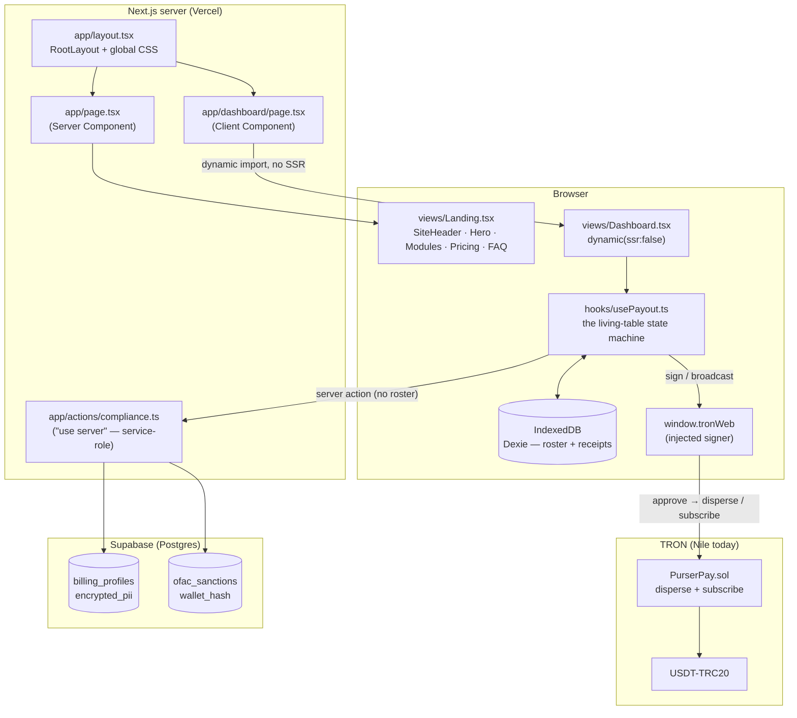

# 01 — Architecture

> **AI disclaimer — read first.** This document is a *map, not the territory*. If
> anything here conflicts with the source, **the source wins**. Cross-check against the
> referenced files before refactoring, and keep this doc in the same change that alters
> the behavior it describes. All paths are repo-relative.

---

## 1. What the machine is (one paragraph)

PurserPay is a **non-custodial, no-KYC USDT (TRON) batch-payout tool**. A de-banked
business loads its team roster, the app validates every address and computes the batch,
and the business signs **one** transaction with its **own** wallet. USDT moves straight
from the payer's wallet to each payee. Purser never holds funds, keys, or broadcast. A
thin server exists only to hide API keys, screen recipients against OFAC, gate an
on-chain subscription, and store the account holder's own PII encrypted — **never** the
roster. See [`02-non-custodial.md`](./02-non-custodial.md) for why this is the whole
product.

## 2. Stack (as built, verified against the repo)

| Layer | Choice | Notes |
| --- | --- | --- |
| Framework | **Next.js 15 App Router** + React 19 + TypeScript (strict) | `next@^15.5`, `react@^19` — see `package.json` |
| Hosting | Vercel (Next.js runtime + serverless/edge) | Server Actions carry the compliance logic |
| UI | **shadcn/ui** + Tailwind **v4** + Radix | components copied into `src/components/ui/` (we own them) |
| Core table | **TanStack Table** via shadcn data-table | `@tanstack/react-table` — the heart of the dashboard |
| Roster storage | **Dexie / IndexedDB** | `src/lib/db.ts`, DB name `purserpay` — device-local |
| Account/compliance storage | **Supabase** (Postgres + pgcrypto) | `supabase/migrations/0001_compliance_schema.sql` |
| Web3 | **tronweb 6** + TronLink (WalletConnect stubbed) | `src/lib/tron/*` |
| Contract | own `PurserPay.sol` (Foundry) | `contracts/` — disperse + subscribe |
| CSV | papaparse | `src/lib/csvImport.ts` |
| Fonts | Fontsource **Inter Tight** (+ JetBrains Mono) | `src/styles/globals.css` |

> Migration note: the repo was a Vite SPA; it is now Next.js. The port was **zero-drift**
> (design/copy identical). `SPRINTS.md` is the Vite-era build log (Spanish, historical).

## 3. Render topology (the one thing to get right first)

Two routes, deliberately separated. The **landing is server-rendered**; the **dashboard
is client-only**. This is not incidental — the dashboard reads IndexedDB and the injected
TronLink wallet **at module load**, neither of which exists during SSR.



Key facts encoded above:

- `src/app/page.tsx` is a **Server Component**; its interactive children (`HeroPayoutCard`,
  the FAQ accordion, the wallet CTA) carry their own `"use client"` boundaries.
- `src/app/dashboard/page.tsx` does `dynamic(() => import("@/views/Dashboard"), { ssr:
  false })` — this reproduces the old Vite SPA's client-only mount and keeps `db.ts` /
  `tron/*` out of the server graph.
- **The roster never crosses the server boundary.** The only things that leave the
  browser are (a) the transaction the user signs, sent by their own wallet to TRON, and
  (b) recipient addresses handed to the OFAC server action / the `/api/payout/authorize`
  route, which hash them transiently and never persist them. See
  [`03-data-flow.md`](./03-data-flow.md).
- **The payout gate is a route handler, not a server action.** `POST /api/payout/authorize`
  fuses OFAC + a server-side subscription read + the free-tier quota into one round trip
  (HTTP status codes); `POST /api/payout/release` refunds a free slot on a verified failure.
  Both are Node-runtime, service-role, and never touch funds/keys. See
  [`07-freemium-gate.md`](./07-freemium-gate.md).

## 4. Directory map

```
src/
├── app/                         # Next.js App Router
│   ├── layout.tsx               # RootLayout, global CSS, <title>/favicon
│   ├── page.tsx                 # "/" landing (Server Component) → views/Landing
│   ├── dashboard/page.tsx       # "/dashboard" (client-only, ssr:false) → views/Dashboard
│   ├── legal/page.tsx           # legal copy
│   ├── privacy/page.tsx         # privacy copy
│   ├── actions/compliance.ts    # "use server" — OFAC + PII (service-role Supabase)
│   └── api/payout/              # ROUTE HANDLERS — the payout authorization gate
│       ├── authorize/route.ts   #   OFAC + server-side subscription + free-tier consume
│       └── release/route.ts     #   free-tier refund (on-chain re-verify, fail-closed)
├── views/
│   ├── Landing.tsx              # single-page IA: #why → #how → #pricing → FAQ
│   └── Dashboard.tsx            # route guard + wires usePayout to the components
├── hooks/
│   └── usePayout.ts             # THE state machine (roster, wallet, verify, 3-gate pay)
├── components/
│   ├── landing/                 # Hero, Modules, PricingSection, Faq, wallet CTA, …
│   ├── dashboard/               # PayoutTable, PayoutControls, SubscribeDialog, OfacBlockedDialog, …
│   └── ui/                      # shadcn primitives (owned, in-repo)
├── lib/
│   ├── compliance/ofac.ts       # screenRecipients — shared OFAC core (action + route)
│   ├── freeTier/                # gate.ts (pure decision) · quota.ts · refund.ts · authorizeClient.ts
│   ├── db.ts                    # Dexie schema (payees, payments, meta)
│   ├── roster.ts                # roster CRUD + atomic CSV replace
│   ├── receipts.ts              # receipt persistence + green-cycle logic
│   ├── receiptPdf.ts            # local print-to-PDF receipts/reports
│   ├── crypto.ts                # hashWalletAddress (salted SHA-256) — pure, no secret
│   ├── csvImport.ts             # papaparse mapping/validation
│   ├── payeeValidation.ts       # payee shape validation
│   ├── supabase/{client,server}.ts   # anon client / service-role (server-only) client
│   └── tron/
│       ├── config.ts            # THE network seam: addresses, prices, caps, feeLimit
│       ├── client.ts            # keyless read client vs. injected signer (kept apart)
│       ├── wallet.ts            # WalletProvider interface (TronLink real, WC stub)
│       ├── validation.ts        # the ✓/✓✓ double-check + privacy invariant
│       ├── disperse.ts          # approve → disperse money path (atomic batches)
│       ├── subscription.ts      # on-chain subscription gate (fail-closed)
│       ├── serverRead.ts        # SERVER-only keyless reads (sub + txid) for the gate
│       │                        #   route handlers — never signs, non-custodial
│       ├── abi.ts               # minimal ABIs + custom-error selector table
│       ├── amount.ts            # human ↔ base-unit conversion (exact)
│       └── errors.ts            # PurserError + revert decoding → calm messages
├── styles/globals.css           # Tailwind v4 CSS-first entry + fonts
contracts/                       # Foundry project (PurserPay.sol + tests)
scripts/tron/                    # deploy / verify / measure (Node .cjs)
supabase/migrations/             # compliance schema
```

Full module responsibilities live in the per-topic docs; this table is the "where do I
look" index:

| I want to understand… | Start at | Deep-dive doc |
| --- | --- | --- |
| The money path (signing, batches) | `src/lib/tron/disperse.ts` | [`02`](./02-non-custodial.md), [`03`](./03-data-flow.md) |
| The subscription paywall | `src/lib/tron/subscription.ts` | [`03`](./03-data-flow.md) |
| OFAC + PII encryption | `src/app/actions/compliance.ts`, `src/lib/crypto.ts` | [`04`](./04-compliance-and-encryption.md) |
| The dashboard state machine | `src/hooks/usePayout.ts` | [`03`](./03-data-flow.md) |
| The contract | `contracts/src/PurserPay.sol` | [`05`](./05-smart-contract.md) |
| Deploy / network switch | `src/lib/tron/config.ts`, `scripts/tron/deploy.cjs` | [`06`](./06-deployment.md) |

## 5. The network seam (`src/lib/tron/config.ts`)

Everything chain-specific lives in **one file**, so switching networks is a config change,
not a code change. It exports:

- `NETWORK` — `{ key, name, fullHost, hostMatch, explorer }`. Currently **Nile testnet**.
- `PURSERPAY_ADDRESS` / `DISPERSE_ADDRESS` — the **same** deployed contract serves both.
- `USDT_ADDRESS`, `USDT_DECIMALS` (6) — must equal the contract's `usdt` immutable.
- `SUBSCRIPTION_PRICE_*` / `_ANNUAL_*` — mirror the contract's fee state (150 / 1,500).
- `BATCH_CAP` (100) and `feeLimitForBatch()` — the signing-boundary + energy sizing.
- `PENDING_DEPLOYMENT_ADDRESS` — sentinel for the fail-closed pre-deploy state.

The concrete addresses and the mainnet-switch checklist are in
[`06-deployment.md`](./06-deployment.md).

## 6. Dependency discipline

shadcn covers UI; Dexie covers the device-local roster; Supabase covers
account/compliance; tronweb covers chain; papaparse covers CSV. **Reach for a new lib
only when those genuinely can't do it.** The contract has **zero external Solidity
dependencies** (inline `ITRC20`, inline ownership) — see [`05`](./05-smart-contract.md).

## 7. Not in V1 (do not build without flagging)

Multichain · Ledger/WebUSB signing · social/password login (magic-link only) · partial
"pay until balance runs out" · multi-wallet source · roles within an agency ·
cross-device **roster** sync · analytics dashboards · **any** server-side storage of the
roster. If a task seems to need one, stop and flag the owner (see `CLAUDE.md`).
