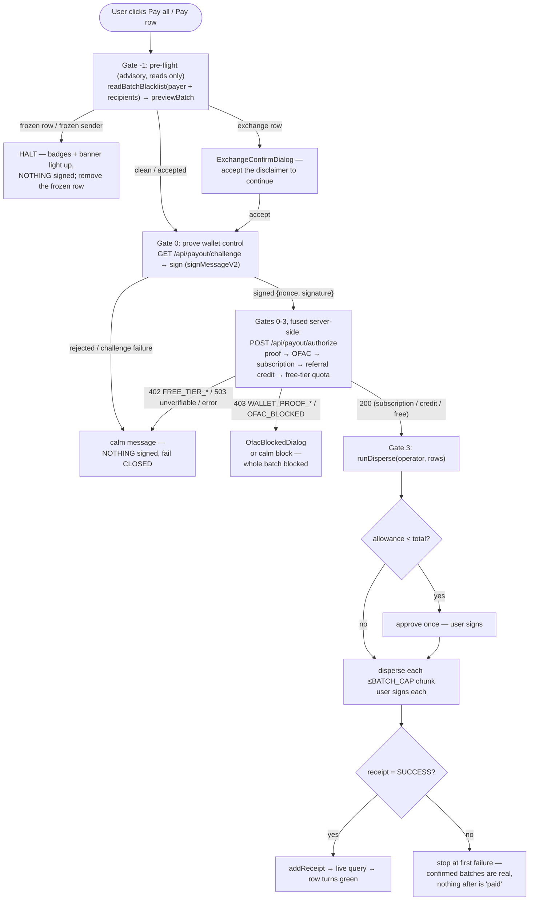
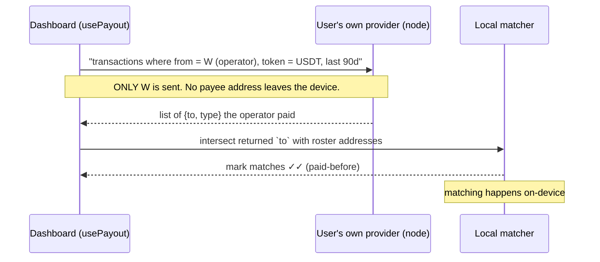

# 03 — Data Flow

> **AI disclaimer — read first.** This document is a *map, not the territory*. If
> anything here conflicts with the source, **the source wins**. Cross-check against the
> referenced files before refactoring, and keep this doc in the same change that alters
> the behavior it describes. All paths are repo-relative.

---

## 1. Two tiers of data, two rules

> **We store nothing we can read.**

| Tier | What | Where | Leaves the browser? |
| --- | --- | --- | --- |
| **Roster** | payee names, addresses, amounts; payout receipts | **IndexedDB (Dexie)** — `src/lib/db.ts` | **Never** in readable form. Two public artifacts leave: the transaction the user signs, and — after it confirms — its **public txid** (best-effort, to populate the dissociated affiliate receipt index; see the note below + [`09`](./09-affiliate-portal.md)). Names, amounts, and cleartext recipient wallets never leave. |
| **Account + compliance** | account holder's PII (name, country, tax id); OFAC screening data; **free-tier usage** (payer-wallet hash + last-used timestamp); **wallet-control challenges** (ephemeral nonce + payer-wallet hash) | **Supabase** — `0001_compliance_schema.sql`, `0002_free_tier_usage.sql`, `0004_payout_challenges.sql` | Yes, but **encrypted** (PII, pgcrypto AES-256) or **salted-hashed** (wallets — OFAC + free-tier + challenge). Never readable. (Subscription state is **on-chain**, read live — not stored here.) |

The dividing line is absolute: **the server never receives the roster.** See
[`04-compliance-and-encryption.md`](./04-compliance-and-encryption.md) for the encrypted
tier; this doc covers the roster tier and the payout pipeline.

> **A third, dissociated server-side store exists — and it is NOT the roster.** Since the affiliate
> portal (Sprint 1A), a **forward-only receipt index** (`disperse_receipts`,
> [`0005_affiliate_portal.sql`](../supabase/migrations/0005_affiliate_portal.sql)) records
> `hash(recipient) + amount + payer + txid`, **all derived from the public on-chain `disperse`
> calldata** — salted-hashed recipients, no names, no cleartext recipient wallets. It is populated
> from the confirmed batch's **public txid** (§4/§5), never from the roster. So "the server never
> receives the roster" holds exactly, while a hashed, on-chain-derived index *does* live server-side.
> Details: [`09`](./09-affiliate-portal.md). (The account/compliance tier likewise spans the referral
> tables, `0003`, and receipt-audit column, `0006` — the migration list above is illustrative, not
> exhaustive.)

## 2. The Dexie schema (`src/lib/db.ts`)

DB name `purserpay`. Three stores (v3; v1 was roster-only, upgraded additively so
existing rosters survive):

| Store | Shape (key fields) | Purpose |
| --- | --- | --- |
| `payees` | `id`, `order`, `name`, `address`, `amount` | The roster. A payee is **name + address + amount** — nothing else decides a payout. `order` is a `Date.now()` sort key (UUID PKs don't iterate in insertion order). |
| `payments` | `id`, `txid`, `network`, `timestamp`, `payeeIds[]`, `recipients[]`, `totalBaseUnits` | A confirmed on-chain batch = the local receipt behind a green row. |
| `meta` | `key`, `value` | Small KV. Holds `greenSince` — the green-cycle boundary. |

**Schema history.** v1: roster only. v2: adds `payments` + `meta` (additive). **v3 (ROLE-1):
retires the decorative payee `role` field.** `role` was never a Dexie *index* (only `id`, `order`
are), so it was a plain stored property — existing payees survive the removal regardless. The v3
`.upgrade()` (`tx.table("payees").toCollection().modify(dropRoleField)`, `src/lib/dbMigrations.ts`)
only strips the now-dead `role` bytes from each stored row; **name/address/amount are preserved —
no roster is wiped.** `dropRoleField` is a pure, node-tested transform (`tests/roster/migration.test.ts`).

Roster CRUD is in `src/lib/roster.ts`; the CSV overwrite path (`replaceRoster`) is an
**atomic** `clear()` + `bulkAdd()` transaction — if anything fails, the existing roster is
left completely untouched, never half-written. A payee is **never** destroyed just because
the balance won't cover them (Law of UX #2 — see [`05` is the contract; UX laws live in
`CLAUDE.md`]).

**Unique addresses — enforced at insertion (`src/lib/rosterDedupe.ts`).** The roster
guarantees each TRON address appears at most once, because the atomic disperse batch is
built straight from it — the same wallet twice would pay one person twice in a single
signature (a silent double-payment of real money). "Duplicate" = the same base58 string,
matched **case-sensitively** (TRON base58 is case-sensitive; two addresses differing only in
case are *different* wallets). The rule is **RETAIN, never DISCARD** — a duplicate is never
silently auto-removed; the user decides which row is valid. `rosterDedupe.ts` (pure,
dependency-free) is the single source of truth, used by both paths:

- **Manual add/edit** (`addPayee` / `updatePayee`): rejects a colliding address with a named
  error *before* persisting (`findAddressOwner`, excluding the row being edited so re-saving
  a payee with its own address is allowed); the existing row is left untouched. `PayeeFormDialog`
  surfaces it in the same error box as shape validation.
- **CSV import** (`applyMapping` → `splitByAddress` + `groupAddressConflicts`): imports the
  **unique** rows immediately and holds back **every** row of a shared-address group (none is
  imported — a duplicate never silently picks a winner). Since **UX-3** the user resolves those
  conflicts **in-app** instead of re-editing their spreadsheet: `applyMapping` also returns the
  **structured** conflicts (the actual competing rows, via `groupAddressConflicts` — the same
  `findDuplicateAddresses` SoT), and a **Dashboard-root `ResolveConflictsDialog`** shows the
  competing rows side by side so the operator picks the one to keep (or **discards** the group).
  The picked rows are appended via the normal `addPayee` path. **The retain-not-discard rule is
  unchanged** — nothing is chosen for you (no auto-pick); a group left unresolved, or discarded,
  imports **neither** row (exactly the S-0 behavior). **Dismissing** the resolver is the S-0
  fallback: uniques imported, conflicts left unimported. The resolver lives at the Dashboard root
  (not inside `ImportCsvDialog`) because importing the uniques flips `isEmpty` and unmounts the
  `EmptyRoster` that hosts the import dialog — so it is driven by `usePayout` state
  (`importConflicts` / `resolveImportConflicts` / `cancelImportConflicts`), like
  `ExchangeConfirmDialog`. `replaceRoster` also carries a defense-in-depth `findDuplicateAddresses`
  guard so the uniqueness invariant holds for any caller. (Dedupe is **within the incoming
  file**; a full overwrite replaces the prior roster anyway.) The importer maps only
  **name / address / amount** (all three required); any other column in the file — including a
  leftover **Role** column from an old spreadsheet — is simply never mapped and **ignored, never
  errored** (ROLE-1 retired the payee `role` field).

## 3. Green = paid (derived, not a flag)

"Paid"/green is **derived from receipts**, not stored on the row. Logic in
`src/lib/receipts.ts`:

- A row is green if a receipt in the **current cycle** on the **current network** lists
  its id (`paidPayeeIds(payments, since)`).
- **Reset** (`advanceGreenCycle`) writes `greenSince = Date.now()` — it does **not** delete
  receipts. Older receipts stay as history but stop greening rows, so next month's payout
  of the same roster can proceed. History (the downloadable report) ignores `since`.
- A receipt on another network never greens a row here (`network` guard), and green
  survives a reload (it's in IndexedDB).
- Both the **green row** (`PayoutTable.tsx`, an inline className over the `paidIds` prop) and the
  **"Paid" status badge** (`columns.tsx`, read via the TanStack cell's `meta`) derive from the same
  `paidIds`. The row is **keyed on its paid state** so it re-mounts the instant `paidIds` flips —
  otherwise the badge (a `meta`-only change TanStack doesn't propagate to the memoized cell) would lag
  the green until a reload. With the key, badge + green flip in the **same render** on pay success.

This is what makes accidental **re-payment structurally hard**: a paid row is visibly
green and excluded from `outstanding`/`payable` in the hook.

## 3b. Pre-flight preview — advisory, mirrors the on-chain guard (S-2)

Before the sign-time pipeline runs, an **advisory** pre-flight classifies every row so the
operator sees a frozen/exchange/unverified destination **before** signing — never as an opaque
revert. It is **advisory only**: the on-chain guard ([`05`](./05-smart-contract.md), `disperse`
reverts a frozen destination) is the real guarantee at sign time. Backend pieces (S-2; the S-3
dashboard renders them):

- **Blacklist read — FAIL-SAFE (D-7).** `readDestinationBlacklist` (`src/lib/tron/serverRead.ts`)
  reads USDT's `getBlackListStatus(dest)` server-side (same keyless node + `TRON_PRO_API_KEY` as
  the subscription read), against the SAME `USDT_ADDRESS` the active network targets. The pure core
  `readBlacklistStatuses` (`src/lib/security/blacklist.ts`) **dedupes** to one read per unique
  address (TronGrid rate limit) and maps `true→FROZEN`, `false→SAFE`, and **any failed/timed-out/
  rate-limited read → `UNVERIFIED`, NEVER `SAFE`** (D-7 — a failure must never render green). Unlike
  the OFAC screen (which fails *closed*), this fails *safe*: it can't hard-block, so a TronGrid
  hiccup degrades to "cannot confirm safe", not "blocked".
- **Exchange detection (advisory, with a declared GAP).** `classifyAddress`
  (`src/lib/security/exchangeDetect.ts`) exact-matches a recipient against a **versioned in-repo
  list** of publicly-labelled exchange addresses (Binance/HTX/Gate seeded; others a noted GAP). It
  catches **tagged** addresses only — **not** per-user deposit addresses (the real cash-out case) —
  and does **not** know each exchange's credit policy, so the downstream disclaimer stays **generic**.
- **`previewBatch`** (`src/lib/security/previewBatch.ts`, pure) merges the two into a per-row
  `status ∈ {READY, FROZEN, EXCHANGE, UNVERIFIED, BLOCKED}`. Its order **mirrors the S-1 guard**
  (`disperse`): the **payer** is evaluated first (`senderFrozen` → `SenderBlacklisted`), then per row
  `FROZEN` (→ `DestinationBlacklisted`, the hard block) **>** `UNVERIFIED` **>** `BLOCKED` (the
  pay-time balance/allowance block, passed IN from `usePayout` — not recomputed) **>** `EXCHANGE`
  (advisory) **>** `READY`. Because preview and execution share the same order, they never disagree;
  `FROZEN`/`senderFrozen` mean "cannot pay", `UNVERIFIED` means "cannot confirm safe".

### 3b-i. How the dashboard renders it (S-3)

The S-3 dashboard turns that classification into what the operator sees. The **visual doctrine is
owner-CLOSED** (encoded in `src/lib/security/preflightView.ts`, asserted in
`tests/security/preflightView.test.ts`):

- **GREEN = PAID, and ONLY paid.** Nothing in the pre-flight is ever green — a clean/ready row shows
  **no security badge** (absence of alarm = ok). There is no "green = safe/ready" state, ever.
- **Per-row badges — the CLOSED row-state model (UX-2).** The address cell shows **exactly one**
  primary line (`rowLineFor`, `preflightView.ts`) plus an orthogonal amber `Exchange?` chip. The line
  is one of, in precedence order: **Invalid address** (red, structural) · **Frozen (Tether)** (red
  `⊘`, `columns.tsx`) · **Paid before** (✓✓, green) · **Verifying…** (neutral spinner, the read is
  queued/in-flight — **transient only**) · **Unverified** (muted, D-7 — the read failed, **never
  shown as safe**) · **Valid on TRON** (✓, aqua). The old grey **"Format ok"** resting state is
  **GONE** — a well-formed row goes straight into **Verifying… → resolved**, never a limbo badge
  (format validation still rejects malformed addresses at insertion; it just no longer surfaces a
  resting badge). **FROZEN** **replaces** the line, is **always visible (never hover-only)**, and
  disables Pay (same `payDisabled` set as OFAC-sanctioned) while the row stays **removable**.
  **`Exchange?`** is a discreet amber chip *next to* the line (advisory; does not replace, does not
  block; hover = the generic S-2-GAP disclaimer). Hover detail is reserved for the **non-blocking**
  states; frozen severity is always on its face. **GREEN = PAID stays intact** — only *Paid before*
  is green; *Valid on TRON* is aqua (`lineTone` asserts `valid ≠ success` in a test).
- **Contextual banner** (`PreflightBanner.tsx`, above the table) — renders **only** when the selected
  batch has ≥1 flagged row (a clean batch shows nothing; zero noise). As of UX-2 each flagged category
  gets its **own one-line strip that EXPLAINS the consequence** (not just a count), shown only when
  that category has ≥1 row: **frozen** ("… would be an irreversible loss; the funds would not reach
  the recipient and can't be recovered — remove to continue") · **exchange** ("… if the exchange
  doesn't credit transfers sent from a contract, the payee may not see the funds — verify before
  paying") · **unverified** ("… couldn't be checked right now — re-checked on-chain when you pay").
  It doubles as the color legend. Honest wording — exchange coverage is partial (S-2 GAP).
- **Accept-and-pay** (`ExchangeConfirmDialog.tsx`) — if the batch contains EXCHANGE rows, the generic
  disclaimer lands **at decide-time**, right before the signature, with an explicit accept. FROZEN
  rows can never reach this step (Pay disabled + the pre-flight halts the batch); the sign path
  re-asserts it (`hasBlockingRow` → **a batch with a frozen row can never be signed**).
- **Add/edit address confirmation** (`PayeeFormDialog.tsx`) — a **new or changed** address must have
  its **last 6 characters** confirmed (a required checkbox) before Save, killing the pasted-corrupted
  (clipboard-malware) vector. Editing only the amount asks nothing.

**Timing & wiring (`usePayout.ts`, UX-1).** The blacklist read is a rate-limited round-trip, so it
runs **EAGERLY when rows enter the roster** (load / add-payee / CSV import) behind a **throttled,
cancelable queue** (`runThrottledReads`, `preflightQueue.ts`; the frozen read now shares this queue
with the resource pre-check's USDT-holding read — one combined round-trip per batch, see §3c) —
**sequential batches of ≤10,
one per second** (a safe margin under TronGrid's ~15/s), so a whole roster resolves without tripping
the limit. Rows awaiting their turn show the neutral **Verifying…** state (never a resolved badge).
The queue is **cancelable / roster-keyed**: a generation token (`eagerGenRef`) is bumped on every
address change, so a read in flight for a now-stale roster is **dropped, never applied** — and because
readings are keyed by **address** (never row id/index), a stale reading can never paint the wrong row.
Only **new** addresses are queued (a reconcile keeps surviving readings), so adding one payee reads
one address and never flips the rest back to Verifying…. The **pay-time read is kept** as a cheap
re-confirm (`preflightThenPay`, GATE -1) covering the seconds-window between resolution and signing —
it is no longer the *first* check. **D-7 fail-safe** end-to-end: a batch read that throws → every
address UNVERIFIED, never SAFE. Exchange classification stays pure/instant (amber chip + banner count
surface on every roster change). Readings **accumulate per address**. The **`--warning` amber token**
(`globals.css`) exists solely for the exchange advisory — distinct from error-red (frozen/sanctioned)
and success-green (**reserved for paid**). All of this is **reads only** — non-custodial is untouched.

## 3c. Resource pre-check — can the wallet AFFORD the batch (energy / bandwidth / TRX)

Separate from the frozen/exchange pre-flight (which asks *"is this address safe?"*), the resource
pre-check asks *"can this wallet pay the on-chain fees?"* — because `disperse` is **all-or-nothing**,
a batch that reverts `OUT_OF_ENERGY` burns the payer's TRX and pays **nobody**. Two layers —
**constant to orient, measurement to gate**:

- **Orient (reactive toolbar).** On every selection change, a pure, node-tested estimate
  (`src/lib/security/resourceCheck.ts`) sizes required **energy** (base + per-recipient, split
  **fresh vs existing USDT holder** — the holding read below; unknown → FRESH, worst case) and
  **bandwidth** (analytical tx-size model), and compares them against the operator's **live**
  resources — energy / bandwidth / TRX + live `getEnergyFee` / `getTransactionFee`, read once per
  wallet-lifecycle event through the injected provider (`src/lib/tron/resources.ts`, mirroring
  `getUsdtBalance`). `fee_limit` is treated correctly as the tx's **total-energy ceiling**
  (`fee_limit ÷ energyFee`), NOT a TRX-burn cap; rented energy lowers the burn, never the ceiling.
  Verdict: **sufficient** (quiet neutral line, Pay all enabled) · **insufficient** (Pay all
  **disabled**, the exact energy/TRX gap + a neutral third-party energy-comparator link) ·
  **unknown** (resources unreadable → honest warning, Pay all **stays enabled** — never block on
  missing data). Rendered in `PayoutControls` (`ResourceLine`); gates `canPayAll` only on a
  **conclusive** insufficient. Green is never used (paid-only); a hard block is red (amber is
  advisory-only, never a block).
- **Gate (authoritative, pay time).** The static energy constant is a snapshot — TRON's dynamic
  energy (`getAllowDynamicEnergy=1`) and protocol/USDT upgrades can raise the real cost, and a
  stale-low constant would produce a false "you're covered". So inside `runDisperse`, **after
  `ensureAllowance` and before each chunk's `.send()`** (the point where the standing allowance makes
  the simulation faithful), `simulateDisperseEnergy` runs a live `triggerConstantContract` of the
  real batch and reads back `energy_used`. That measured figure **sizes the actual `fee_limit`**
  (`feeLimitFromEnergy`, at the live `energyFee`) and, if the freshly-read wallet can't afford it,
  **blocks with the real number before any signature**. Simulation unavailable → fall back to the
  constant-sized `feeLimitForBatch`, never a false block.

**The fresh-vs-holder holding read.** The eager pre-flight queue (§3b-i) reads **two** signals per
address in **one** combined server round-trip (`readBatchPreflight` → `readDestinationPreflight`,
same server-only `TRON_PRO_API_KEY` seam as the frozen read): the frozen status **and** whether the
address currently holds USDT (`balanceOf > 0`), over the shared `runThrottledReads` throttle. Holding
tells a fresh recipient (the expensive new-storage write, ~157k energy) from an existing holder
(~1.72× cheaper); a failed/unknown holding read → **FRESH** (worst case), so the estimate never
under-sizes. All reads only — non-custodial untouched.

## 4. The payout pipeline — the 3-gate choke-point

Every payout — "Pay all" or a single row — funnels through **one** entry, `preflightThenPay(rows)`
in `src/hooks/usePayout.ts`, which runs the advisory **GATE -1** pre-flight (§3b) and then hands a
clean/accepted batch to `executePayout(rows)`, the real signing path that enforces the three gates
in order. This is the single most important control-flow in the app.

Gate specifics (all in `usePayout.ts` → `preflightThenPay` then `executePayout`, plus `canPayAll`):

- **Gate -1 — pre-flight (advisory, reads only; runs FIRST).** As of UX-1 the recipient blacklist is
  read **eagerly** when rows enter the roster (§3b-i "Timing & wiring"), so the badges/banner light up
  **before** the operator ever clicks Pay. `preflightThenPay` then re-reads the payer + every recipient
  (`readBatchBlacklist`) as a cheap seconds-window re-confirm and classifies the batch (`previewBatch`,
  §3b). A **frozen** row or sender **halts** the flow — nothing is signed, the operator removes the
  frozen row. An **exchange** row opens the accept-and-pay disclaimer. A clean (or accepted) batch
  proceeds to Gate 0. Fail-safe (D-7): a catastrophic read failure marks everything UNVERIFIED (never
  SAFE), which does not block — the on-chain guard is the real gate.
- **Gate 0 — prove wallet control (runs after the pre-flight).** Before any server state is touched,
  `executePayout` calls `proveWalletControl` (`src/lib/payout/challengeClient.ts`): fetch a
  single-use challenge (`GET /api/payout/challenge`) and sign it with the connected wallet
  (`signMessageV2`, one prompt). The `{nonce, signature}` ride along in the authorize body; the
  server recovers the signer and asserts it equals `payerAddress` **before** OFAC / subscription
  / quota / credit — so a spoofed payer can never consume a real customer's free slot or credit
  month. A rejection or challenge failure fails **closed** (nothing signed). See
  [`07-freemium-gate.md`](./07-freemium-gate.md) §4a.
- **Gates 1–2 now run SERVER-SIDE in one round trip** — `POST /api/payout/authorize`
  (`src/app/api/payout/authorize/route.ts`) fuses OFAC + a server-side subscription read +
  the free-tier quota. The client never decides authorization; a `402/403/503`/network
  error all **fail closed** (nothing signed). See [`07-freemium-gate.md`](./07-freemium-gate.md).
  - **OFAC** — screen ALL recipients (`screenRecipients`, shared with the roster-wide
    "value demo" screen). A hit blocks the **whole** batch (`403 OFAC_BLOCKED`).
  - **Entitlement** — `isSubscriptionActive(payer)` read server-side via TronGrid
    (`src/lib/tron/serverRead.ts`). Active → unlimited (credit untouched). If not active,
    the gate then checks **referral credit** (`checkCredit` → `consume_referral_credit`, one
    atomic RPC): a running or freshly-activated credit month → unlimited too. Unverifiable
    chain read **and** no credit → `503`, fail closed. A banked month is only ever consumed
    when the chain is DEFINITIVELY inactive — never on an unverifiable read. See
    [`08-referrals-and-credit.md`](./08-referrals-and-credit.md).
  - **Free tier** — reached only with no subscription and no credit. `count > 1` → `402
    FREE_TIER_BATCH_LIMIT`; `count === 1` → an ATOMIC quota consume (`200` authorized, or
    `402 FREE_TIER_COOLDOWN`). Consumed OPTIMISTICALLY, before broadcast.
- **Gate 3 — disperse.** Only reached on a `200`. Runs `runDisperse` (§5), which also carries the
  **authoritative resource gate** (§3c): before each chunk's signature it simulates the real batch,
  sizes the `fee_limit` from the measured energy, and **blocks with the real number** if the wallet
  can't afford it — the last line of defence against an `OUT_OF_ENERGY`-that-pays-nobody. On a
  free-mode failure/rejection (including this energy block) the client calls `POST /api/payout/release`
  to restore the slot (the server re-verifies the txid on-chain; never trusts the client). See
  [`07`](./07-freemium-gate.md).

The roster still **never leaves the device**: the authorize route receives only the payer
address, the recipient count, and the recipient addresses OFAC already required — never
names or amounts.

`canPayAll` additionally requires: connected, right network, not already paying/screening,
`payable.length > 0`, `blockedCount === 0`, and `shortfallUnits <= 0n` (balance covers the
selected sum). This is UX Law #2 ("zero fear") made mechanical — the button is locked, and
tells you how much is missing, rather than letting a payout revert.

## 5. The money path (`src/lib/tron/disperse.ts`)

`runDisperse(operator, rows, events, signal)`:

1. Convert every amount to exact base units up front (`toBaseUnits`) — a bad amount fails
   here, before any signature, naming the row.
2. Compute the grand total; split rows into `ceil(N / BATCH_CAP)` chunks (`BATCH_CAP`
   = 100). This is a **signing boundary, never a partial-pay boundary** — each chunk is
   independently atomic.
3. **Approve once** for the grand total, but only if the standing allowance is short
   (fewer signatures = closer to the ≤3-click law).
4. Disperse each chunk with a `feeLimit` sized by `feeLimitForBatch()` (energy-based; see
   `config.ts`). The user's **own** wallet signs each.
5. Poll each tx's receipt (`waitForReceipt`). A batch is reported **confirmed only** once
   its on-chain receipt says `SUCCESS`. **Stop at the first failure** — every already-
   confirmed batch is genuinely on-chain; nothing in or after a failed batch is ever
   reported paid. A half-batch or a "paid" that didn't move money is structurally
   impossible.

> **Forward-only receipt index (affiliate portal).** On each `SUCCESS`, alongside the device-local
> `addReceipt`, `usePayout` (`onBatchConfirmed`) fires a best-effort `recordDisperse(txid)` →
> `POST /api/affiliate/record` (`src/lib/affiliate/recordClient.ts`). It sends **only the public
> txid**; the server re-verifies + decodes the on-chain calldata and salt-hashes recipients into
> `disperse_receipts` — never the roster, never a name or cleartext recipient wallet. This is the
> txid egress noted in §1. See [`09`](./09-affiliate-portal.md) §2.

Atomicity guarantee: the on-chain `disperse` is all-or-nothing (see
[`05`](./05-smart-contract.md)). The frontend never paints green except on a `SUCCESS`
receipt.

> **Mainnet allowance reset (implemented):** mainnet USDT-TRC20 requires resetting a non-zero
> allowance to 0 before re-approving; the Nile mock does not. `ensureAllowance`
> (`src/lib/tron/allowance.ts`, wired into both `disperse.ts` and `subscription.ts`) handles
> this: a non-zero-but-short allowance is cleared to 0 (confirmed by receipt) before the real
> approve, and the extra wallet prompt is announced calmly (Law of UX #2). See
> [`06-deployment.md`](./06-deployment.md) §6.

## 6. The subscription read (`src/lib/tron/subscription.ts`)

- `getSubscriptionStatus(account)` reads `subscriptionExpiresAt(account)` over the app's
  **keyless read client** (never the injected wallet) — reading via the wallet is what used
  to make the public landing touch TronLink on load. `account` is only the constant-call
  `from`; nothing is signed, no prompt is raised.
- **Fail-closed twice over:** if the contract isn't deployed (`PURSERPAY_ADDRESS ===
  PENDING_DEPLOYMENT_ADDRESS`) it returns `active: false` with no chain call; a read failure
  throws `rpcUnreachable`, and every caller treats a throw as "not subscribed", never active.
- `runSubscribe(operator, plan, …)` approves the plan's price to PurserPay (if the allowance
  is short), then calls `subscribe(planType)` — the user's **own** wallet signs. Plan 0 =
  monthly (150/30d), plan 1 = annual (1,500/365d).

> On-chain reality check: `subscribe(planType)` supports **both** plans live —
> `planType 0` = monthly (150/30d), `planType 1` = annual (1,500/365d). Both the dashboard
> subscribe modal and the landing pricing section sign the user's **chosen** plan via a
> selector in the shared `SubscribeDialog`: the dashboard opens it on **plan 0** (monthly,
> the deliberate default for an irreversible payment); the landing opens it on the plan the
> user picked in the pricing cards (a last-chance confirmation).

### Subscribe order (why payment precedes storage)

In `usePayout.ts` → `subscribe(pii)`: (1) pay on-chain **first** from the user's own
wallet — if it throws, nothing is stored (no orphan PII for a non-subscriber); (2) only on
success, persist the encrypted PII via the server action (**best-effort** — a store
failure must not re-open the dialog, since re-clicking would re-charge: `runSubscribe`
isn't idempotent); (3) re-read the gate → active → close the paywall.

## 7. The ✓ / ✓✓ double-check and its privacy invariant

`src/lib/tron/validation.ts` — the "zero fear" heart of the table, and the most
privacy-sensitive read in the app.

| Level | Meaning | Reads |
| --- | --- | --- |
| `invalid` | fails `tronWeb.isAddress` | **offline**, nothing leaves the device |
| `valid-format` | structurally valid, on-chain status unknown (pre-connect / no indexer) | offline |
| `valid` (✓) | account is **activated** on-chain (real, used address) | via the user's own provider |
| `paid-before` (✓✓) | the **connected wallet** has sent USDT to this exact address within `HISTORY_WINDOW_DAYS` (90) | via the user's own provider |

**THE NON-NEGOTIABLE PRIVACY INVARIANT:** the ✓✓ history read sends exactly **one**
address — the operator's own wallet `W` — to the node, and only to the provider the
user's own wallet already talks to. It asks "what did `W` send?" and matches the returned
payee addresses **locally**. **Payee addresses are never transmitted for ✓✓.** There is no
Purser server, no Purser API key, no Purser-controlled endpoint in this path. If the
provider can't answer (a bare node with no indexer), ✓✓ **degrades** to ✓ / valid-format
— it is *never* replaced by a Purser-side call.

If you touch this file, preserve the invariant. Adding a Purser API key or sending payee
addresses to any endpoint for verification is a **critical privacy regression**.

## 8. Receipts and reports (`src/lib/receipts.ts`, `src/lib/receiptPdf.ts`)

Purely local, read-only, no chain call, no funds:

- **Per-row receipt** — a `justificante` for one payee: reads the batch that paid them in
  the current cycle, narrows the recipient list to that one person (the tx/date stay the
  batch's — the on-chain proof is the batch tx), prints to PDF with a Tronscan link.
- **Full report** — every paid recipient still in the roster, across every batch on this
  network, newest first, each with its date and Tronscan link. Ignores `since` (survives a
  Reset), but a payee removed from the dashboard drops from the report.

## 9. Deleting local data

`deleteAllData()` clears the entire local DB (roster, payment history, green-cycle meta)
plus session tx/selection state. It is **device-local only** — the account's encrypted PII
in Supabase and the on-chain subscription are untouched (that's the correct boundary: local
wipe ≠ account erasure; GDPR erasure of the PII is a separate server action — see
[`04`](./04-compliance-and-encryption.md)).
