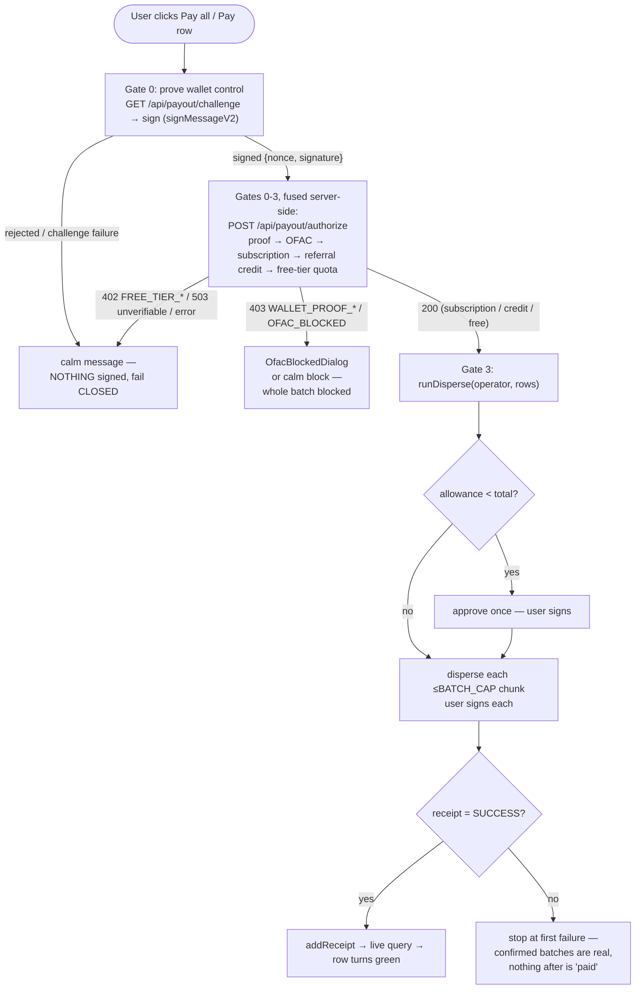
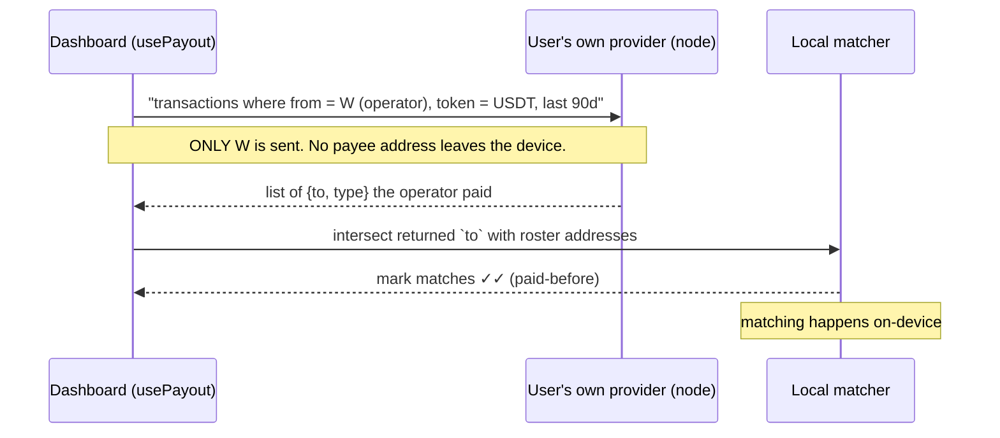

# 03 — Data Flow

> **AI disclaimer — read first.** This document is a *map, not the territory*. If
> anything here conflicts with the source, **the source wins**. Cross-check against the
> referenced files before refactoring, and keep this doc in the same change that alters
> the behavior it describes. All paths are repo-relative.

---

## 1. Two tiers of data, two rules

> **We store nothing we can read.**

| Tier | What | Where | Leaves the browser? |
| --- | --- | --- | --- |
| **Roster** | payee names, roles, addresses, amounts; payout receipts | **IndexedDB (Dexie)** — `src/lib/db.ts` | **Never** in readable form. The only thing that leaves is the transaction the user signs. |
| **Account + compliance** | account holder's PII (name, country, tax id); OFAC screening data; **free-tier usage** (payer-wallet hash + last-used timestamp); **wallet-control challenges** (ephemeral nonce + payer-wallet hash) | **Supabase** — `0001_compliance_schema.sql`, `0002_free_tier_usage.sql`, `0004_payout_challenges.sql` | Yes, but **encrypted** (PII, pgcrypto AES-256) or **salted-hashed** (wallets — OFAC + free-tier + challenge). Never readable. (Subscription state is **on-chain**, read live — not stored here.) |

The dividing line is absolute: **the server never receives the roster.** See
[`04-compliance-and-encryption.md`](./04-compliance-and-encryption.md) for the encrypted
tier; this doc covers the roster tier and the payout pipeline.

## 2. The Dexie schema (`src/lib/db.ts`)

DB name `purserpay`. Three stores (v2; v1 was roster-only, upgraded additively so
existing rosters survive):

| Store | Shape (key fields) | Purpose |
| --- | --- | --- |
| `payees` | `id`, `order`, `name`, `role`, `address`, `amount` | The roster. `order` is a `Date.now()` sort key (UUID PKs don't iterate in insertion order). |
| `payments` | `id`, `txid`, `network`, `timestamp`, `payeeIds[]`, `recipients[]`, `totalBaseUnits` | A confirmed on-chain batch = the local receipt behind a green row. |
| `meta` | `key`, `value` | Small KV. Holds `greenSince` — the green-cycle boundary. |

Roster CRUD is in `src/lib/roster.ts`; the CSV overwrite path (`replaceRoster`) is an
**atomic** `clear()` + `bulkAdd()` transaction — if anything fails, the existing roster is
left completely untouched, never half-written. A payee is **never** destroyed just because
the balance won't cover them (Law of UX #2 — see [`05` is the contract; UX laws live in
`CLAUDE.md`]).

## 3. Green = paid (derived, not a flag)

"Paid"/green is **derived from receipts**, not stored on the row. Logic in
`src/lib/receipts.ts`:

- A row is green if a receipt in the **current cycle** on the **current network** lists
  its id (`paidPayeeIds(payments, since)`).
- **Reset** (`advanceGreenCycle`) writes `greenSince = Date.now()` — it does **not** delete
  receipts. Older receipts stay as history but stop greening rows, so next month's payout
  of the same roster can proceed. History (the downloadable report) ignores `since`.
- A receipt on another network never greens a row here (`network` guard), and green
  survives a reload (it's in IndexedDB).

This is what makes accidental **re-payment structurally hard**: a paid row is visibly
green and excluded from `outstanding`/`payable` in the hook.

## 4. The payout pipeline — the 3-gate choke-point

Every payout — "Pay all" or a single row — funnels through **one** function:
`runPayment(rows)` in `src/hooks/usePayout.ts`. It enforces three gates in order. This is
the single most important control-flow in the app.

Gate specifics (all in `usePayout.ts` → `runPayment`, plus `canPayAll`):

- **Gate 0 — prove wallet control (runs FIRST).** Before any server state is touched,
  `runPayment` calls `proveWalletControl` (`src/lib/payout/challengeClient.ts`): fetch a
  single-use challenge (`GET /api/payout/challenge`) and sign it with the connected wallet
  (`signMessageV2`, one prompt). The `{nonce, signature}` ride along in the authorize body; the
  server recovers the signer and asserts it equals `payerAddress` **before** OFAC / subscription
  / quota / credit — so a spoofed payer can never consume a real customer's free slot or credit
  month. A rejection or challenge failure fails **closed** (nothing signed). See
  [`07-freemium-gate.md`](./07-freemium-gate.md) §4a.
- **Gates 1–2 now run SERVER-SIDE in one round trip** — `POST /api/payout/authorize`
  (`src/app/api/payout/authorize/route.ts`) fuses OFAC + a server-side subscription read +
  the free-tier quota. The client never decides authorization; a `402/403/503`/network
  error all **fail closed** (nothing signed). See [`07-freemium-gate.md`](./07-freemium-gate.md).
  - **OFAC** — screen ALL recipients (`screenRecipients`, shared with the roster-wide
    "value demo" screen). A hit blocks the **whole** batch (`403 OFAC_BLOCKED`).
  - **Entitlement** — `isSubscriptionActive(payer)` read server-side via TronGrid
    (`src/lib/tron/serverRead.ts`). Active → unlimited (credit untouched). If not active,
    the gate then checks **referral credit** (`checkCredit` → `consume_referral_credit`, one
    atomic RPC): a running or freshly-activated credit month → unlimited too. Unverifiable
    chain read **and** no credit → `503`, fail closed. A banked month is only ever consumed
    when the chain is DEFINITIVELY inactive — never on an unverifiable read. See
    [`08-referrals-and-credit.md`](./08-referrals-and-credit.md).
  - **Free tier** — reached only with no subscription and no credit. `count > 1` → `402
    FREE_TIER_BATCH_LIMIT`; `count === 1` → an ATOMIC quota consume (`200` authorized, or
    `402 FREE_TIER_COOLDOWN`). Consumed OPTIMISTICALLY, before broadcast.
- **Gate 3 — disperse.** Only reached on a `200`. Runs `runDisperse` (§5). On a free-mode
  failure/rejection the client calls `POST /api/payout/release` to restore the slot (the
  server re-verifies the txid on-chain; never trusts the client). See [`07`](./07-freemium-gate.md).

The roster still **never leaves the device**: the authorize route receives only the payer
address, the recipient count, and the recipient addresses OFAC already required — never
names or amounts.

`canPayAll` additionally requires: connected, right network, not already paying/screening,
`payable.length > 0`, `blockedCount === 0`, and `shortfallUnits <= 0n` (balance covers the
selected sum). This is UX Law #2 ("zero fear") made mechanical — the button is locked, and
tells you how much is missing, rather than letting a payout revert.

## 5. The money path (`src/lib/tron/disperse.ts`)

`runDisperse(operator, rows, events, signal)`:

1. Convert every amount to exact base units up front (`toBaseUnits`) — a bad amount fails
   here, before any signature, naming the row.
2. Compute the grand total; split rows into `ceil(N / BATCH_CAP)` chunks (`BATCH_CAP`
   = 100). This is a **signing boundary, never a partial-pay boundary** — each chunk is
   independently atomic.
3. **Approve once** for the grand total, but only if the standing allowance is short
   (fewer signatures = closer to the ≤3-click law).
4. Disperse each chunk with a `feeLimit` sized by `feeLimitForBatch()` (energy-based; see
   `config.ts`). The user's **own** wallet signs each.
5. Poll each tx's receipt (`waitForReceipt`). A batch is reported **confirmed only** once
   its on-chain receipt says `SUCCESS`. **Stop at the first failure** — every already-
   confirmed batch is genuinely on-chain; nothing in or after a failed batch is ever
   reported paid. A half-batch or a "paid" that didn't move money is structurally
   impossible.

Atomicity guarantee: the on-chain `disperse` is all-or-nothing (see
[`05`](./05-smart-contract.md)). The frontend never paints green except on a `SUCCESS`
receipt.

> **Mainnet caveat (flagged in code):** mainnet USDT-TRC20 requires resetting a non-zero
> allowance to 0 before re-approving. The Nile mock does not. See
> [`06-deployment.md`](./06-deployment.md).

## 6. The subscription read (`src/lib/tron/subscription.ts`)

- `getSubscriptionStatus(account)` reads `subscriptionExpiresAt(account)` over the app's
  **keyless read client** (never the injected wallet) — reading via the wallet is what used
  to make the public landing touch TronLink on load. `account` is only the constant-call
  `from`; nothing is signed, no prompt is raised.
- **Fail-closed twice over:** if the contract isn't deployed (`PURSERPAY_ADDRESS ===
  PENDING_DEPLOYMENT_ADDRESS`) it returns `active: false` with no chain call; a read failure
  throws `rpcUnreachable`, and every caller treats a throw as "not subscribed", never active.
- `runSubscribe(operator, plan, …)` approves the plan's price to PurserPay (if the allowance
  is short), then calls `subscribe(planType)` — the user's **own** wallet signs. Plan 0 =
  monthly (150/30d), plan 1 = annual (1,500/365d).

> On-chain reality check: `subscribe(planType)` supports **both** plans live —
> `planType 0` = monthly (150/30d), `planType 1` = annual (1,500/365d). Both the dashboard
> subscribe modal and the landing pricing section sign the user's **chosen** plan via a
> selector in the shared `SubscribeDialog`: the dashboard opens it on **plan 0** (monthly,
> the deliberate default for an irreversible payment); the landing opens it on the plan the
> user picked in the pricing cards (a last-chance confirmation).

### Subscribe order (why payment precedes storage)

In `usePayout.ts` → `subscribe(pii)`: (1) pay on-chain **first** from the user's own
wallet — if it throws, nothing is stored (no orphan PII for a non-subscriber); (2) only on
success, persist the encrypted PII via the server action (**best-effort** — a store
failure must not re-open the dialog, since re-clicking would re-charge: `runSubscribe`
isn't idempotent); (3) re-read the gate → active → close the paywall.

## 7. The ✓ / ✓✓ double-check and its privacy invariant

`src/lib/tron/validation.ts` — the "zero fear" heart of the table, and the most
privacy-sensitive read in the app.

| Level | Meaning | Reads |
| --- | --- | --- |
| `invalid` | fails `tronWeb.isAddress` | **offline**, nothing leaves the device |
| `valid-format` | structurally valid, on-chain status unknown (pre-connect / no indexer) | offline |
| `valid` (✓) | account is **activated** on-chain (real, used address) | via the user's own provider |
| `paid-before` (✓✓) | the **connected wallet** has sent USDT to this exact address within `HISTORY_WINDOW_DAYS` (90) | via the user's own provider |

**THE NON-NEGOTIABLE PRIVACY INVARIANT:** the ✓✓ history read sends exactly **one**
address — the operator's own wallet `W` — to the node, and only to the provider the
user's own wallet already talks to. It asks "what did `W` send?" and matches the returned
payee addresses **locally**. **Payee addresses are never transmitted for ✓✓.** There is no
Purser server, no Purser API key, no Purser-controlled endpoint in this path. If the
provider can't answer (a bare node with no indexer), ✓✓ **degrades** to ✓ / valid-format
— it is *never* replaced by a Purser-side call.

If you touch this file, preserve the invariant. Adding a Purser API key or sending payee
addresses to any endpoint for verification is a **critical privacy regression**.

## 8. Receipts and reports (`src/lib/receipts.ts`, `src/lib/receiptPdf.ts`)

Purely local, read-only, no chain call, no funds:

- **Per-row receipt** — a `justificante` for one payee: reads the batch that paid them in
  the current cycle, narrows the recipient list to that one person (the tx/date stay the
  batch's — the on-chain proof is the batch tx), prints to PDF with a Tronscan link.
- **Full report** — every paid recipient still in the roster, across every batch on this
  network, newest first, each with its date and Tronscan link. Ignores `since` (survives a
  Reset), but a payee removed from the dashboard drops from the report.

## 9. Deleting local data

`deleteAllData()` clears the entire local DB (roster, payment history, green-cycle meta)
plus session tx/selection state. It is **device-local only** — the account's encrypted PII
in Supabase and the on-chain subscription are untouched (that's the correct boundary: local
wipe ≠ account erasure; GDPR erasure of the PII is a separate server action — see
[`04`](./04-compliance-and-encryption.md)).
