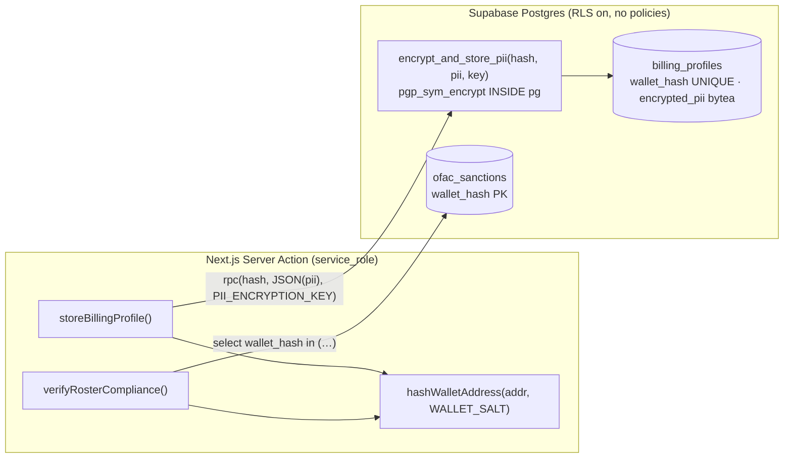

# 04 — Compliance & Encryption

> **AI disclaimer — read first.** This document is a *map, not the territory*. If
> anything here conflicts with the source, **the source wins**. Cross-check against the
> referenced files before refactoring, and keep this doc in the same change that alters
> the behavior it describes. All paths are repo-relative.

---

## 1. Why a server exists at all

Purser runs a backend for **exactly four** reasons, none of which is custody: hide API
keys, enforce OFAC, gate the on-chain subscription, and hold encrypted account PII. It
never touches funds, keys, broadcast, or the roster. This doc covers the compliance +
encryption slice; see [`02`](./02-non-custodial.md) for the custody boundary and
[`03`](./03-data-flow.md) for where these calls sit in the payout pipeline.

The two design principles, restated:

- **Data dissociation:** identity is separated from payout activity *by schema design*.
- **Store nothing we can read:** PII is encrypted at rest (pgcrypto AES-256); wallet
  addresses are salted-SHA-256 hashed. No plaintext of either lands in the database.

## 2. The compliance API (`src/app/actions/compliance.ts`)

A `"use server"` module — Next.js **Server Actions**, run only on the server, using the
**service-role** Supabase client (bypasses RLS). The browser never talks to Supabase for
compliance. Secrets are read from server env and never reach the client (no
`NEXT_PUBLIC_` prefix; the module is server-only).

### `verifyRosterCompliance(addresses: string[]): Promise<string[]>`

OFAC-screens a roster. Returns the **original** addresses that are sanctioned; `[]` means
clean.

- Hashes each address server-side with `WALLET_SALT` (the client **can't** — the salt is
  server-only), builds a `hash → original` map (dedupes automatically), and checks the
  hashes against `ofac_sanctions` via the service-role client.
- **Fails CLOSED:** a missing secret or any DB error **throws**. The caller
  (`usePayout.ts`) treats a throw as "cannot verify → block the batch", never "clean". An
  empty array is only ever returned after a *successful* check.
- **Persists nothing** — addresses are hashed only to run the lookup, keeping the roster
  device-local.

### `storeBillingProfile(address: string, piiPayload: string): Promise<void>`

Encrypts and stores the account holder's PII.

- Hashes the account's wallet into the dissociated key (`WALLET_SALT`), then calls the
  `encrypt_and_store_pii` RPC, which encrypts `piiPayload` with `PII_ENCRYPTION_KEY`
  (`pgp_sym_encrypt`, AES) **inside Postgres** and upserts the ciphertext. The plaintext
  PII never lands in a column, and the encryption key is never stored in the DB.
- `piiPayload` is **opaque** to this layer — the caller serializes the PII (JSON of
  `{name, country, taxId}`) into a string; this layer only ever handles its encrypted form
  at rest.

> The PII (`BillingPii = {name, country, taxId}`) is collected by the paywall and sent
> **straight** to this server action — **never** persisted client-side (no Dexie, no
> localStorage). See `usePayout.ts` → `subscribe`.

## 3. Wallet hashing (`src/lib/crypto.ts`)

```
hashWalletAddress(address, salt) = SHA-256( `${salt}:${address.trim()}` )  // 64-char hex
```

- **Pure and portable:** reads no env, holds no secret. The caller passes the salt
  (`WALLET_SALT`, a server-only pepper), so the file is safe to import anywhere while the
  secret stays in server code.
- **Why salted:** wallet addresses are low-entropy (the TRON base58 space is enumerable and
  the OFAC SDN list is public), so a plain unsalted hash would be rainbow-table
  reversible. It is the **secret salt**, not the hash alone, that makes these values
  non-reversible and non-correlatable across datasets.
- **Normalization is trim-only — never lowercase.** TRON base58 is case-sensitive. Any code
  that hashes the OFAC list for comparison **must** use the identical salt and the same
  trim-only normalization, or the hashes won't line up.
- Node `crypto` (sync) → **Node runtime only**. An Edge-runtime path (e.g. Edge middleware)
  would need an async Web-Crypto variant; it is not built.
- Rotating `WALLET_SALT` re-keys **every** stored hash — treat it as permanent once
  compliance data exists.

## 4. The Supabase schema (`supabase/migrations/0001_compliance_schema.sql`)

Idempotent; safe to run in the Supabase SQL editor or via `supabase db push`.



Components:

1. **pgcrypto** installed into the `extensions` schema (provides `pgp_sym_encrypt` /
   `pgp_sym_decrypt`, AES).
2. **`billing_profiles`** — `id uuid pk`, `wallet_hash text unique` (the dissociated key —
   a plaintext hash, already pseudonymous, so not itself encrypted), `encrypted_pii bytea`
   (the ciphertext), `created_at`/`updated_at`.
3. **`ofac_sanctions`** — `wallet_hash text pk`, `created_at`. Salted-hash only — no
   plaintext addresses ever land in the DB.
4. **Zero-trust lockdown** — `enable row level security` with **no policies** on both
   tables → `anon` and `authenticated` are denied by default. Only `service_role` (used
   exclusively by the Server Actions) bypasses RLS, so the browser can never read the
   sanctions list or any PII.
5. **`encrypt_and_store_pii(p_wallet_hash, p_pii, p_key)`** — `security invoker`, pinned
   `search_path = public, extensions`, fully parameterized (no string concatenation). The
   AES key is supplied by the server per call and **never persisted**. Upserts on
   `wallet_hash` conflict.
6. **Grants** — RPC execute revoked from PUBLIC, granted to `service_role` only.
   Table-level `select/insert/update` granted to `service_role` (BYPASSRLS skips *policies*
   but not table-level GRANTs, else Postgres returns 42501). `ofac_sanctions` is read-only
   to the server.
7. `notify pgrst, 'reload schema'` at the end so the RPC/grants resolve over the API.

## 5. The env-var contract

| Var | Exposure | Used by | Notes |
| --- | --- | --- | --- |
| `NEXT_PUBLIC_SUPABASE_URL` | **public** (inlined into client bundle) | client + server | intentional |
| `NEXT_PUBLIC_SUPABASE_ANON_KEY` | **public** | client | protected by RLS |
| `SUPABASE_SERVICE_ROLE_KEY` | **server-only** | `src/lib/supabase/server.ts` | bypasses RLS — never ship to client |
| `WALLET_SALT` | **server-only** | `crypto.ts` via server actions | global hashing pepper; rotating re-keys all hashes |
| `PII_ENCRYPTION_KEY` | **server-only** | `encrypt_and_store_pii` RPC | AES key; rotating makes existing ciphertext undecryptable |
| `NEXT_PUBLIC_WC_PROJECT_ID` | public (optional) | `wallet.ts` | enables the WalletConnect option (stub today) |
| `REFERRALS_ENABLED` | **server-only** | `src/lib/referral/config.ts` | referral kill switch; **default off** — gates reward grants + the dashboard card (attribution + honoring existing credit always run) |
| `TRON_PRO_API_KEY` | **server-only** (optional) | `src/lib/tron/serverRead.ts` | lifts TronGrid rate limits for the gate's server-side reads; unnecessary on Nile |
| `PRIVATE_KEY` | **local/deploy only** | `scripts/tron/deploy.cjs` | gitignored `.env`; NOT used by the running app |

Rules (also in `.env.local.example`):

- Anything without a `NEXT_PUBLIC_` prefix is never inlined into the client bundle.
- `src/lib/supabase/server.ts` imports `"server-only"` — a **build-time** guarantee: if any
  client component (directly or transitively) imports it, the build fails. Belt-and-
  suspenders on top of the missing `NEXT_PUBLIC_` prefix.
- Generate secrets with e.g. `node -e "console.log(require('crypto').randomBytes(32).toString('hex'))"`.
- `WALLET_SALT` and `PII_ENCRYPTION_KEY` are **effectively permanent** once compliance data
  exists — rotating either is a data-migration event, not a config tweak.

## 6. GDPR — dissociation + Art. 17 erasure

- Account-holder PII is encrypted at rest (pgcrypto AES-256); wallets are salted-hashed.
  The schema dissociates identity from payout activity by design.
- A **right-to-erasure** request wipes the account's PII from Supabase (delete the
  `billing_profiles` row by `wallet_hash`). The roster is **already device-local**, so it
  is under the user's control from the start — clearing it is `deleteAllData()` on the
  device (see [`03`](./03-data-flow.md) §9), not a server operation.
- **`free_tier_usage` is out of scope for erasure — deliberately.** It holds only a salted
  hash of the **payer** wallet + a timestamp (no PII), and it is **not linked to the
  account holder** (that dissociation is the point — the quota can't be correlated to an
  identity). Its retention is governed by a **60-day TTL purge**, not the Art. 17 path. See
  [`07-freemium-gate.md`](./07-freemium-gate.md).

## 6a. Fiscal data collected at CHECKOUT, not at connect (Free Tier)

Since the Free Tier, the dashboard admits any connected wallet (free mode). The fiscal
form (name, country, tax ID) is therefore **no longer demanded to enter** — it lives only
in the subscribe/checkout flow (`SubscribeDialog` → `storeBillingProfile`), where we
actually need it to issue an invoice. This keeps the free path (connect → import → screen →
pay 1) free of any KYC-shaped step, consistent with the "no-KYC" brand. The encryption /
dissociation of that PII is unchanged (§2–§4).

## 6b. Free-tier hashing (same pepper as OFAC)

The `free_tier_usage.payer_wallet_hash` uses the **same** `WALLET_SALT` pepper and
trim-only normalization as OFAC (`src/lib/crypto.ts` → `hashWalletAddress`, via
`src/lib/freeTier/quota.ts` → `payerWalletHash`). The raw payer address never lands in the
DB. Access is service-role-only through `security invoker` RPCs (`consume_free_tier`,
`release_free_tier`, `purge_free_tier_usage`); RLS is on with no policies. See
[`07`](./07-freemium-gate.md) §4.

## 6c. Referral tables (same dissociation posture, no PII)

The referral schema (`supabase/migrations/0003_referrals.sql` — `referral_accounts`,
`referral_rewards`) keys every wallet by the **same** salted `WALLET_SALT` hash as OFAC and
the free tier (`src/lib/referral/accounts.ts` → `referralWalletHash` → `hashWalletAddress`).
No raw address, **no PII**, and **no FK to `billing_profiles`** — the shared pseudonymous
hash reveals no identity, matching `free_tier_usage`. The `referral_code` is opaque and
**random**, never derived from the wallet (`src/lib/referral/code.ts`), so the public share
link can't be reversed to a treasury address. RLS is on with no policies; access is
service-role-only via `security invoker` RPCs. Like `free_tier_usage`, these tables hold no
PII and are **out of scope for Art. 17 erasure**; unlike it they have **no TTL** (a referral
account is the customer's durable referral identity). See
[`08`](./08-referrals-and-credit.md).

## 6d. Wallet-control challenge table (same dissociation posture, no PII)

The wallet-control challenge (`supabase/migrations/0004_payout_challenges.sql` —
`payout_challenges`) keys every wallet by the **same** salted `WALLET_SALT` hash as OFAC, the
free tier, and referrals (`src/lib/payout/challenge.ts` → `challengeWalletHash` →
`hashWalletAddress`). Each row is a salted `wallet_hash` + an **ephemeral CSPRNG nonce** + a
5-minute expiry — **no raw address, no PII**, and no link to the account holder. RLS is on with
no policies; access is service-role-only via `security invoker` RPCs (`issue_payout_challenge`,
`consume_payout_challenge`, `purge_payout_challenges`). Like `free_tier_usage` it holds no PII
and is **out of scope for Art. 17 erasure**; a **1-day TTL purge** is its whole retention story
(challenges live only for the one round trip between connect and authorize). The atomic
single-use `consume_payout_challenge` is the replay + TOCTOU defense. See
[`07`](./07-freemium-gate.md) §4a. **No new env var** — it reuses `WALLET_SALT` and the
service-role client.

## 7. Loading the OFAC list (operational note)

`ofac_sanctions` is populated **out of band** with salted hashes of sanctioned addresses,
using the **same** `WALLET_SALT` and trim-only normalization as `crypto.ts` — otherwise the
hashes won't match at screening time. There is no in-repo loader script for this yet; if you
add one, it must import/replicate `hashWalletAddress` exactly and run server-side with the
production salt. Flag any divergence in salt or normalization as a screening-correctness bug.
