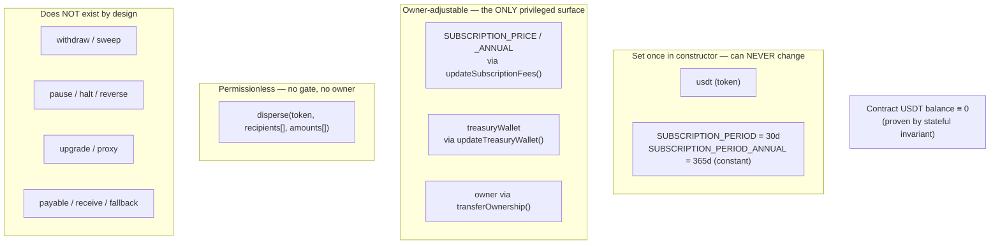

# 05 — The Smart Contract (`PurserPay.sol`)

> **AI disclaimer — read first.** This document is a *map, not the territory*. If
> anything here conflicts with the source, **the source wins**. Cross-check against
> `contracts/src/PurserPay.sol` and `contracts/test/PurserPay.t.sol` before touching the
> contract. All paths are repo-relative.

---

## 1. What it is

One contract, `contracts/src/PurserPay.sol`, does two unrelated jobs and **holds
nothing**:

- **`disperse()`** — a **free**, permissionless batch-payout utility. USDT moves straight
  payer → each recipient via `transferFrom`; no fee, no percentage, no retained funds.
  This is the compliance moat: Purser has zero control over user funds.
- **`subscribe(planType)`** — the flat monetization. Pulls **exactly** the plan's current
  price from the subscriber and forwards it, in the same transaction, to a cold treasury.

Zero external Solidity dependencies: `ITRC20` is declared inline and ownership is inline
(no OpenZeppelin import), matching the pure-Foundry / forge-std-only build.

## 2. Invariant & ownership model

**The owner can never** touch funds, hold custody, access keys, broadcast, pause anything,
or alter `disperse()`. Its *only* powers are setting the two fee numbers, **redirecting the
treasury that receives our own subscription fee** (`updateTreasuryWallet`), and handing off
the role. See [`02-non-custodial.md`](./02-non-custodial.md) for how this reconciles with
"non-custodial".

> **Why `treasuryWallet` is owner-updatable (and not immutable).** It was `immutable`. That
> meant moving revenue to a hardware/multisig wallet later would have required a FRESH DEPLOY —
> and since there is no proxy, a redeploy is a new contract that **wipes every subscriber's
> on-chain `subscriptionExpiresAt`**. So the safest future action (hardening custody) carried
> the highest possible cost. Making it updatable removes that trap. It only ever *receives*
> our own fee — `disperse()` never references it — so redirecting it cannot touch user custody.
> `usdt` stays immutable (changing the token would break every standing approval).

| Invariant | Guaranteed by |
| --- | --- |
| Contract's own token balance is always 0 | every transfer is direct payer→recipient / subscriber→treasury; no code path receives tokens. Foundry `invariant_*` test. |
| `usdt` never changes | `immutable`, set in constructor, zero-address-guarded (`ZeroAddressConfig`). |
| `treasuryWallet` moves ONLY via `updateTreasuryWallet` (owner) | storage, zero-address-guarded; receives our own fee only, never in `disperse()`, so it can never reach user funds/custody. |
| `disperse` is permissionless & immutable | no `onlyOwner`, no fee, no subscription check; logic can't be upgraded (no proxy). |
| The **free tier is NOT and CANNOT be enforced on-chain** | `disperse` gates nothing — the 1-payee/30-day free tier is an OFF-CHAIN licence gate in `/api/payout/authorize`, exactly like OFAC. A direct TronWeb `disperse()` bypasses it (accepted). Do **not** add a gate to `disperse`. → [`07`](./07-freemium-gate.md) |
| You can't subscribe by paying less/more | `subscribe` reads the price **live from storage** and pulls exactly it; a short balance/allowance reverts the whole tx. |
| No fee lock-out | `transferOwnership` guards the zero address; there is **no renounce**. |
| Reentrancy-safe subscribe | CEI: the expiry write **precedes** the `transferFrom`; a failed transfer rolls the expiry back. |

## 3. Storage & constructor

| Name | Type | Set by | Notes |
| --- | --- | --- | --- |
| `usdt` | `address immutable` | constructor | the USDT-TRC20 token subscriptions are charged in |
| `treasuryWallet` | `address` (storage) | constructor, `updateTreasuryWallet` | wallet receiving every subscription payment; owner-updatable so it can move to cold/multisig without a redeploy |
| `owner` | `address` | constructor (`msg.sender`), `transferOwnership` | sole privileged account (fee governance only) |
| `SUBSCRIPTION_PRICE` | `uint256` | constructor `150e6`, `updateSubscriptionFees` | monthly (plan 0), base units (6 dp) |
| `SUBSCRIPTION_PRICE_ANNUAL` | `uint256` | constructor `1500e6`, `updateSubscriptionFees` | annual (plan 1) |
| `SUBSCRIPTION_PERIOD` | `uint256 constant` | — | `30 days` |
| `SUBSCRIPTION_PERIOD_ANNUAL` | `uint256 constant` | — | `365 days` |
| `subscriptionExpiresAt` | `mapping(address => uint256)` | `subscribe` | unix expiry; read by the off-chain gate |

`constructor(address _usdt, address _treasuryWallet)` — reverts `ZeroAddressConfig` if
either is zero; sets `owner = msg.sender` (emits `OwnershipTransferred(0, deployer)`);
initializes fees to `150e6 / 1500e6`.

> The names `SUBSCRIPTION_PRICE` / `SUBSCRIPTION_PRICE_ANNUAL` were kept identical when they
> changed from `constant` to mutable state, so the compiler getters `SUBSCRIPTION_PRICE()`
> / `SUBSCRIPTION_PRICE_ANNUAL()` are unchanged — frontend, scripts, and tests keep reading
> them.

## 4. Functions

| Function | Access | Effect |
| --- | --- | --- |
| `disperse(address token, address[] recipients, uint256[] amounts)` | permissionless | Atomic batch pay. Guards: `LengthMismatch`, `EmptyBatch`, per-index `ZeroAddressRecipient`/`ZeroAmount`; `_safeTransferFrom` each; emits `Dispersed(payer, token, count, total)`. All-or-nothing. |
| `subscribe(uint8 planType)` | any caller | Reads price/period for plan 0 or 1 (`InvalidPlan` otherwise); writes `expiry = now + period` (CEI); `_safeTransferFrom(usdt, caller, treasury, price)`; emits `SubscriptionPaid`. |
| `isSubscriptionActive(address) view` | view | `subscriptionExpiresAt[account] > block.timestamp`. |
| `updateSubscriptionFees(uint256 newMonthly, uint256 newAnnual)` | `onlyOwner` | Sets both prices; emits `SubscriptionFeesUpdated`. Applies to every subsequent `subscribe`; existing subs and `disperse` untouched. |
| `updateTreasuryWallet(address newTreasury)` | `onlyOwner` | Redirects where future subscription fees are sent; zero-address-guarded; emits `TreasuryWalletUpdated`. Moves only our own revenue destination — never user funds, custody, or `disperse`. Applies to every subsequent `subscribe`. |
| `transferOwnership(address newOwner)` | `onlyOwner` | Hands off `owner`; zero-address-guarded; emits `OwnershipTransferred`. No renounce. |
| `_safeTransferFrom(token, from, to, amount)` | `private` | `token.call(transferFrom…)`; treats revert **or** a `false` return as failure → `TransferFailed`. Mirrors OZ SafeERC20 without the dependency. |

> **Known behavior (per spec):** `updateSubscriptionFees` has **no bounds** — the owner
> could set a fee to 0 (a free period; `transferFrom` of 0 succeeds). Intentional
> flexibility; no floor/ceiling validation. Flag if bounds are ever wanted.

> **Frontend note:** **both** plans are live and reachable. The shared `SubscribeDialog`
> (`src/components/dashboard/SubscribeDialog.tsx`) carries a plan selector, so the dashboard
> subscribe modal **and** the landing pricing section both sign `subscribe(0)` **or**
> `subscribe(1)` via `runSubscribe` (`src/lib/tron/subscription.ts`). There is no
> "monthly-only" frontend path anymore.

> **Referral credit is OFF-CHAIN — the contract is unchanged.** `subscribe()` writes
> `expiry = now + period`, i.e. it **RESETS** the expiry (it does not add to it). The
> referral loop ([`08`](./08-referrals-and-credit.md)) grants **off-chain, additive** credit
> months in Supabase; the gate reads `onChainActive(this contract) || creditActiveUntil >
> now`. The contract knows nothing about credit and is the **source of truth for
> payments** — a referral reward only ever follows a real, verified on-chain `subscribe` tx
> (a credit-activated month has no tx, so it never earns a reward).

## 5. Events & custom errors

**Events:** `SubscriptionPaid(subscriber, amount, timestamp, expirationTime)`,
`SubscriptionFeesUpdated(newMonthly, newAnnual)`,
`TreasuryWalletUpdated(previousTreasury, newTreasury)`,
`OwnershipTransferred(previousOwner, newOwner)`,
`Dispersed(payer, token, recipientCount, totalAmount)`.

**Errors:** `LengthMismatch`, `EmptyBatch`, `ZeroAddressRecipient(index)`,
`ZeroAmount(index)`, `TransferFailed(token, from, to, amount)`, `ZeroAddressConfig`,
`InvalidPlan(planType)`, `NotOwner`.

> The `disperse`/`Dispersed`/four-guard **selectors are byte-for-byte preserved** from the
> prior `PurseDisperseUsdt` contract, so the frontend's positional call and revert-decoding
> keep working across the rename to PurserPay.

## 6. ABI ↔ frontend mapping (`src/lib/tron/abi.ts`)

The frontend hand-maintains a minimal ABI + a **selector table** because a reverted TRON tx
only surfaces a generic "REVERT opcode executed" — the decodable 4-byte custom-error
selector lives in the mined tx's `receipt.contractResult`, so the frontend decodes it
itself to show a calm human message.

| ABI export | Purpose |
| --- | --- |
| `DISPERSE_ABI` / `PURSERPAY_ABI` (alias) | full contract surface; `disperse.ts` binds `DISPERSE_ABI`, new code prefers `PURSERPAY_ABI` |
| `ERC20_ABI` | `balanceOf`, `allowance`, `decimals`, `approve` (USDT-TRC20) |
| `DISPERSED_TOPIC0`, `SUBSCRIPTION_PAID_TOPIC0` | event topic0 for log matching (no `0x` prefix — TRON's log format) |
| `ERROR_SELECTORS` | 4-byte selector → `{name, indexHint}`; the four disperse guards were verified live on Nile, the transfer/config/plan guards are keccak-derived, plus two OZ ERC20 errors surfaced through the mock |

If you change any error or event signature in the contract, you **must** update the
selectors/topics here or the frontend will show raw reverts.

## 7. Toolchain & the TVM constraint

`contracts/foundry.toml`:

- `solc = 0.8.20`, `optimizer = true`, `optimizer_runs = 200`.
- **`evm_version = istanbul`** — **critical for TRON.** The TVM does **not** support the
  `PUSH0` opcode. solc 0.8.20 defaults to the `shanghai` target, which emits `PUSH0` →
  that bytecode reverts on TRON. `istanbul` is the last pre-PUSH0 target. Never change this
  without re-confirming TVM compatibility.

The deploy script (`scripts/tron/deploy.cjs`) deploys **exactly** the forge-built artifact
(`contracts/out/PurserPay.sol/PurserPay.json`) — forge is the source of truth for the
bytecode; there is no re-compile at deploy time. See [`06-deployment.md`](./06-deployment.md).

## 8. Tests (`contracts/test/PurserPay.t.sol`)

**30 tests: 29 unit + 1 stateful invariant.** Run with `cd contracts && forge test -vv`.

Coverage includes: constructor immutables + owner grant; disperse happy-path,
length/empty/zero guards, atomicity, non-compliant-token handling; subscribe for both
plans, exact-price pull, `InvalidPlan`, expiry math; the owner surface
(`updateSubscriptionFees` updates + charges the new price, `NotOwner` reverts,
`transferOwnership` hand-off + zero-address guard); and **`updateTreasuryWallet`** (owner
redirects the treasury → a subsequent `subscribe` pays the NEW treasury and not the old
one, `NotOwner` reverts, zero-address guard, `TreasuryWalletUpdated` event, and disperse +
the never-holds-USDT invariant unaffected). The stateful **`invariant_*`** test asserts the
contract **never holds USDT** across a fuzzed call sequence (last run: 128,000 calls, 0
reverts).

When you change the contract, extend these tests **and** update this doc + `abi.ts` in the
same change.
